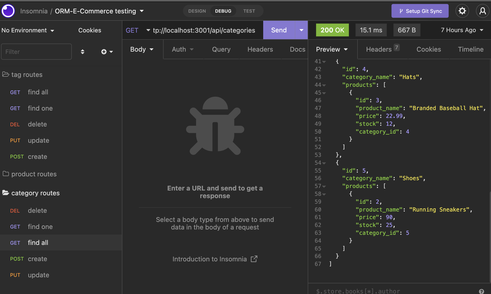

## ORM-E-Commerce

# Description

Your challenge is to build the back end for an e-commerce site. You’ll take a working Express.js API and configure it to use Sequelize to interact with a MySQL database.
  
# Table of Contents

*[Installation](#installation)

*[Usage](#usage)

*[License](#license)

*[Contributing](#contributing)

*[Test](#test)

*[Questions](#questions)
  
  
# Installation

npm install node, sequelize, mysql, express and dotenv
  
# Usage

# License
  
This project is licensed under 

# Contributing

myself and help from tutors
  
# Test
type in the api routes to insomnia and witht he information it generates you can choose which option you want.
  
# Questions
To see more of my projects, go to [Darbybiddy](https://github.com/Darbybiddy)
If you have any questions, you can contact me at [darbybiddy3@gmail.com](mailto:darbybiddy3@gmail.com)

